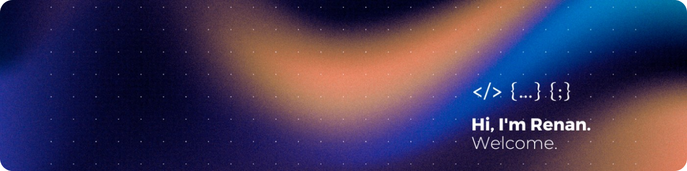

PORTFOLIO

  Olá, bem vindo ao meu perfil no GitHub! 
  Te convido a conhecer melhor os meus projetos.

 

"Neste momento, estou iniciando uma jornada para me tornar um <strong>desenvolvedor full-stack</strong>, buscando expertise em linguagens como JavaScript e Python.

Minha abordagem abrangente engloba um sólido <strong>conhecimento tanto em front-end quanto em back-end</strong>, possibilitando-me criar experiências envolventes para os usuários e sistemas robustos."

 

  
  Stacks

  

 

  
  Databases

  

 

  
  Contact

 
  
   
   

    

  
  

